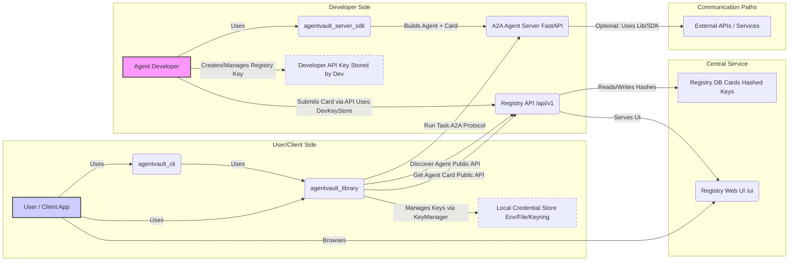

# AgentVault Architecture

This document provides a high-level overview of the AgentVault ecosystem architecture, illustrating how the different components interact to enable secure agent discovery and communication.

## Vision

AgentVault aims to be the open-source backbone for a thriving multi-agent ecosystem. It provides the standards, tools, and infrastructure necessary for agents built by anyone, anywhere, to find each other and collaborate effectively and securely.

## Component Overview

The ecosystem consists of several distinct but interconnected Python packages and services:

1.  **`agentvault_library` (Core Client Library):** The foundation for client-side interactions. Contains the `AgentVaultClient` (handles A2A protocol logic), `KeyManager` (secure credential storage), Pydantic models (AgentCard, A2A messages), and utility functions (card parsing, MCP handling). Used by the CLI and any custom application wanting to interact with agents.
2.  **`agentvault_cli` (Command Line Interface):** The primary tool for end-users and developers to interact with the system from the terminal. Uses the `agentvault_library` to perform actions like configuring keys, discovering agents via the registry, and running tasks on agents.
3.  **`agentvault_registry` (Registry API & UI):** A central FastAPI web service acting as the discovery hub. It stores Agent Card metadata submitted by developers in a PostgreSQL database. It provides a public REST API (`/api/v1`) for searching/retrieving cards and an authenticated API for developers to manage their listings. It also serves a basic **Web UI** for public discovery (`/ui`) and developer management (`/ui/developer`).
4.  **`agentvault_server_sdk` (Server SDK):** A toolkit for developers *building* A2A-compliant agents. Provides base classes (`BaseA2AAgent`), FastAPI integration helpers (`create_a2a_router`, `@a2a_method`), task state management abstractions, and packaging utilities (`agentvault-sdk package`) to simplify agent development and deployment.
5.  **`agentvault_testing_utils` (Testing Utilities):** A shared internal package containing mocks, pytest fixtures, factories, and assertion helpers used across the test suites of the other components to ensure consistency and reduce boilerplate. Not intended for direct use by end-users.

## Interaction Flow Diagram

**Explanation of Flows:**

1.  **Discovery:** A user or client application (using the Library or CLI) queries the Registry API's public endpoints (`/api/v1/...`) or browses the public Web UI (`/ui`) to find agents based on criteria.
2.  **Card Retrieval:** The client retrieves the specific Agent Card for the desired agent from the Registry API (public endpoint).
3.  **Interaction (Client -> Agent):**
    *   The client application uses the information in the retrieved Agent Card (endpoint `url`, `authSchemes`).
    *   The `agentvault_library`'s `KeyManager` component attempts to load the necessary local credentials.
    *   The `AgentVaultClient` constructs and sends A2A protocol requests directly to the target Agent Server's endpoint, automatically adding required authentication headers.
    *   The Agent Server receives the request, authenticates it, processes the task, and sends back responses/events.
4.  **Registration (Developer -> Registry):**
    *   The Agent Developer uses their unique Developer API Key with the authenticated endpoints of the Registry API (`/api/v1/...`) or potentially the Developer Portal UI (`/ui/developer`) to submit or manage their Agent Cards.
    *   The Registry API verifies the key against stored hashes.

## Key Architectural Principles

*   **Decentralized Execution:** Agents run independently. The Registry is only for discovery metadata.
*   **Standardized Interface:** Communication relies on the defined [AgentVault A2A Profile v0.2](a2a_profile_v0.2.md) and the `AgentCard` schema.
*   **Component-Based:** Logical components (library, CLI, registry, SDK, testing utils) with distinct responsibilities.
*   **Security Focus:** Secure credential management, hashed keys, HTTPS enforcement, TEE awareness.
*   **Developer Experience:** SDK and CLI tools simplify common tasks.
