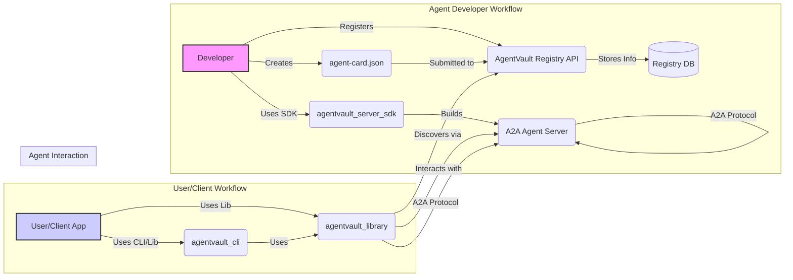

# AgentVault Architecture

This document provides a high-level overview of the AgentVault ecosystem architecture and the roles of its main components.

## Overall Vision

AgentVault aims to create a standardized and secure environment for AI agents to discover and interact with each other. It consists of core libraries, a central discovery service, development tools, and example implementations.

## Core Components

*   **`agentvault_library` (Client Library):**
    *   Provides the `AgentVaultClient` for initiating A2A communication (JSON-RPC/SSE).
    *   Includes the `KeyManager` for securely handling API keys and OAuth credentials from various sources (env, file, keyring).
    *   Defines Pydantic models for Agent Cards and A2A protocol messages/events.
    *   Contains utilities for parsing and validating Agent Cards.
    *   Used by both the `agentvault_cli` and potentially by end-user applications or other agents acting as clients.

*   **`agentvault_cli` (Command Line Interface):**
    *   User-facing tool for interacting with the ecosystem.
    *   Commands: `config` (manage keys), `discover` (query registry), `run` (execute tasks on agents).
    *   Relies heavily on `agentvault_library` for its core functionality.

*   **`agentvault_registry` (Registry API & UI):**
    *   A central FastAPI application.
    *   Provides RESTful API endpoints (`/api/v1/`) for:
        *   Agent Card submission (requires developer authentication).
        *   Agent Card listing, searching, and filtering (public).
        *   Agent Card retrieval by ID (public).
        *   Agent Card validation utility.
        *   (Future) Developer management.
    *   Persists Agent Card and developer information in a PostgreSQL database (using SQLAlchemy and Alembic for migrations).
    *   Includes a basic web UI (`/ui`) for public discovery and a developer portal (`/ui/developer`) for card management.
    *   Handles developer authentication using API keys.

*   **`agentvault_server_sdk` (Server SDK):**
    *   A library to help developers build A2A-compliant agents.
    *   Provides `BaseA2AAgent` abstract class.
    *   Offers FastAPI integration (`create_a2a_router`) to automatically expose agent methods via the required JSON-RPC endpoint (`/a2a`).
    *   Includes abstractions for task state management (`BaseTaskStore`, `InMemoryTaskStore`).
    *   Provides utilities for packaging agents (Dockerfile generation via `agentvault-sdk` CLI tool).

*   **`agentvault_testing_utils` (Testing Utilities):**
    *   A shared library (not intended for end-users) containing mocks (`MockAgentVaultClient`), pytest fixtures (`mock_a2a_server`), factories (`create_test_agent_card`), and assertion helpers used across the other components' test suites.

## Key Interactions

1.  **Agent Registration:** A developer builds an agent (potentially using the SDK), creates an `agent-card.json`, and uses their developer API key to submit the card to the Registry API (`POST /api/v1/agent-cards/`).
2.  **Agent Discovery:** A user (via CLI) or client application (via Library) queries the Registry API (`GET /api/v1/agent-cards/`) to find agents based on search terms or capabilities (like TEE support).
3.  **Task Execution:** The client (CLI/Library) uses the `url` from the retrieved Agent Card to interact directly with the target A2A Agent Server endpoint (`/a2a`).
    *   Authentication is handled based on the `authSchemes` in the Agent Card (API Key, OAuth, None).
    *   Communication follows the A2A JSON-RPC profile (methods like `tasks/send`, `tasks/get`, `tasks/sendSubscribe`).
    *   Streaming responses use Server-Sent Events (SSE).
