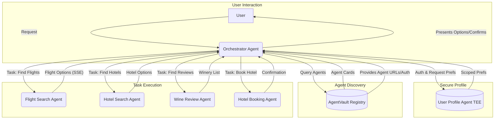
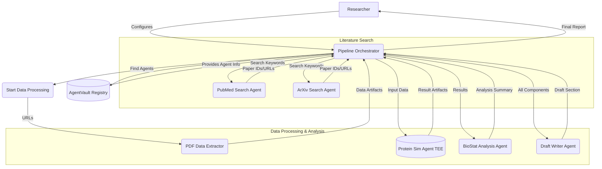
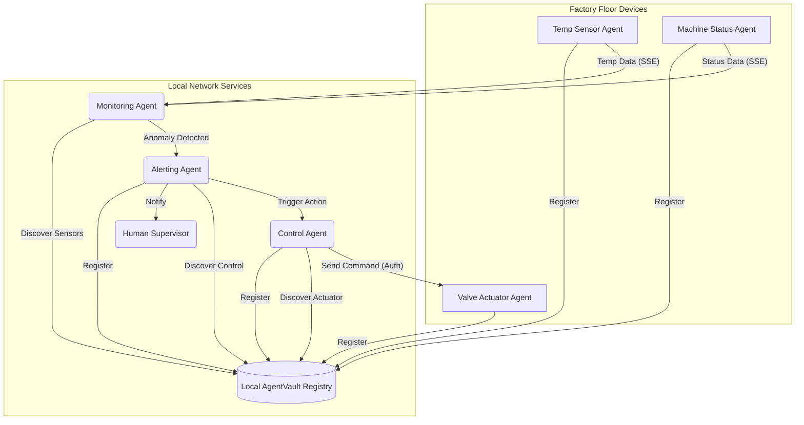

# AgentVault Use Cases & Scenarios

The core [AgentVault Vision](vision.md) is to enable a future where diverse AI agents can collaborate securely and effectively. This page provides more concrete examples of complex workflows made possible or significantly easier by the AgentVault ecosystem and its foundational components.

These scenarios illustrate how features like **standardized discovery (Registry)**, **secure interoperable communication (A2A Profile)**, **robust authentication (Auth Schemes & KeyManager)**, and **developer tooling (SDKs, Library)** come together.

---

## Scenario 1: Hyper-Personalized Concierge & Automated Life Management

**The Goal:** An AI personal assistant that proactively manages complex tasks like travel planning by securely coordinating multiple specialized agents based on deep user preferences.

**The Workflow:**

1.  **User Request:** The user tells their primary **Orchestrator Agent**, "Plan a relaxing weekend trip to Napa Valley next month for two people, budget under $1000. We want to visit 2-3 wineries known for excellent Cabernet Sauvignon, prefer boutique hotels with refundable rates, and need flights from SFO."
2.  **Secure Context Retrieval:** The Orchestrator Agent authenticates (e.g., using OAuth2) with the user's **User Profile Agent**. This agent runs in a **TEE** and securely stores sensitive preferences. It only releases relevant, scoped information.
3.  **Dynamic Discovery (Registry):** The Orchestrator queries the **AgentVault Registry** for agents with capabilities like `flights`, `hotels`, `wine-reviews`, `booking`.
4.  **Parallel Task Delegation (A2A):** The Orchestrator tasks the discovered agents (`FlightSearchAgent`, `WineReviewAgent`, `HotelSearchAgent`) via A2A.
5.  **Asynchronous Results & Streaming (A2A + SSE):** Agents respond, potentially streaming results (like flight options) via **SSE**.
6.  **Synthesis & User Interaction:** The Orchestrator correlates information and presents synthesized options to the user.
7.  **Secure Action Execution (A2A + Auth):** Upon user confirmation of an itinerary, the Orchestrator securely instructs the `HotelBookingAgent` (using its required auth scheme) to make the booking.

**Diagram:**

**How AgentVault Enables This:**

*   **Registry:** Essential for discovering the specialized `FlightSearch`, `HotelSearch`, `WineReview`, and `Booking` agents dynamically.
*   **A2A Protocol:** Provides the standard language for the Orchestrator to task diverse agents and receive structured results or streamed updates (SSE).
*   **Auth Schemes & KeyManager:** Enables secure, standardized authentication between the Orchestrator, the sensitive User Profile Agent, and the transactional Booking Agent.
*   **TEE Awareness:** Allows the User Profile Agent to declare its secure TEE status, increasing trust.
*   **(Future) MCP:** Would allow richer context to be passed securely.

---

## Scenario 2: Automated Scientific Discovery Pipeline

**The Goal:** Accelerate research by automating the process of finding relevant studies, extracting key data, running complex simulations (potentially on secure hardware), analyzing results, and drafting reports.

**The Workflow:**

1.  **Setup:** A researcher configures a **Pipeline Orchestrator Agent**.
2.  **Literature Search (Discovery & A2A):** Orchestrator finds and tasks `PubMedSearchAgent` / `ArXivSearchAgent` via the **Registry** and **A2A**.
3.  **Data Retrieval:** Search agents return paper identifiers/URLs.
4.  **Information Extraction (A2A & Artifacts):** Orchestrator tasks `PDFDataExtractionAgent` with URLs. Agent returns structured data **Artifacts**.
5.  **Simulation Setup (TEE & A2A):** Orchestrator finds `ProteinFoldingSimAgent` (declaring **TEE** support) via Registry. *(Future: Verifies attestation)*. Tasks agent via **A2A** with input data references.
6.  **Secure Simulation:** Simulation Agent runs computation in TEE, returns result **Artifacts**.
7.  **Analysis (A2A):** Orchestrator tasks `BioStatAnalysisAgent` with simulation results. Agent returns statistical summaries.
8.  **Report Generation (A2A):** Orchestrator sends components to `DraftWriterAgent`, receives draft manuscript section.

**Diagram:**

**How AgentVault Enables This:**

*   **Registry:** Crucial for finding specialized scientific agents. Filtering by **TEE support** is key.
*   **A2A Protocol:** Defines standard methods for tasking and retrieving complex results, including **Artifacts**.
*   **Artifacts:** Provides a standard way to reference and exchange potentially large data files.
*   **TEE Declaration:** Allows simulation agents to advertise their enhanced security posture.
*   **Modularity:** Researchers can easily swap components found in the registry.

---

## Scenario 3: Decentralized & Resilient Smart Factory Monitoring

**The Goal:** Monitor and control factory floor equipment from various vendors in a resilient way, reducing reliance on a single central cloud and enabling faster local responses.

**The Workflow:**

1.  **Local Deployment & Registration:** **Device Agents** (on edge hardware) register with a **local AgentVault Registry**.
2.  **Local Monitoring (Discovery & SSE):** A local **Monitoring Agent** discovers relevant Device Agents via the local Registry and subscribes to data streams using `tasks/sendSubscribe` (**SSE**).
3.  **Anomaly Detection & Alerting (A2A):** Monitoring Agent detects an anomaly, finds an `AlertingAgent` via Registry, and sends an alert message via **A2A**.
4.  **Automated Response (Discovery & A2A + Auth):** Alerting Agent notifies humans *and* tasks a `ControlAgent` (or specific Device Agent capability) via **A2A** using required **Auth Scheme** (e.g., `apiKey`) managed by `KeyManager`.
5.  **Resilience:** Local loops function even if external internet fails.

**Diagram:**

**How AgentVault Enables This:**

*   **Local Registry:** Enables discovery and coordination within a private network.
*   **Standardized A2A:** Allows heterogeneous devices (wrapped as agents) to communicate.
*   **SSE Streaming:** Enables efficient real-time monitoring.
*   **Auth Schemes & KeyManager:** Secures control commands locally.
*   **Decentralization:** Facilitates a more resilient architecture.

---

These scenarios illustrate how AgentVault's focus on discovery, standardized communication, security, and developer tooling provides the necessary foundation for building sophisticated, collaborative multi-agent systems in diverse domains.
