```mermaid
flowchart TD
    subgraph UserInteraction["User Interaction"]
        User(("👤 User"))
        Orchestrator[/"🧠 OrchestratorAgent"/]
    end
    
    subgraph SecureProfile["Secure User Profile"]
        ProfileAgent[("👤 Profile Agent(TEE)")]
    end
    
    subgraph AgentDiscovery["Agent Discovery"]
        Registry["📚 Registry"]
        FlightAgent["✈️ Flight SearchAgent"]
        HotelAgent["🏨 Hotel SearchAgent"]
        BookingAgent{"🔐 Booking Agent(Auth Required)"}
    end
    
    User --> Orchestrator
    Orchestrator --> User
    
    Orchestrator <--> ProfileAgent
    
    Orchestrator <--> Registry
    Orchestrator <--> FlightAgent
    Orchestrator <--> HotelAgent
    Orchestrator <--> BookingAgent
    
    style Orchestrator fill:#ff9e80,stroke:#ff6e40,color:black
    style Registry fill:#80d8ff,stroke:#40c4ff,color:black
    style ProfileAgent fill:#ea80fc,stroke:#e040fb,color:black
    style FlightAgent fill:#b9f6ca,stroke:#69f0ae,color:black
    style HotelAgent fill:#b9f6ca,stroke:#69f0ae,color:black
    style BookingAgent fill:#84ffff,stroke:#18ffff,color:black
    style User fill:#fff59d,stroke:#ffee58,color:black

```

```mermaid
flowchart LR
    Researcher(("👩‍🔬 Researcher"))
    Orchestrator[/"🧠 PipelineOrchestrator"/]
    Registry(("📚 Registry"))
    
    subgraph Research["Research & Analysis Pipeline"]
        direction TB
        SearchAgent["🔎 LiteratureSearch Agent"]
        Extractor["📄 PDF ExtractAgent"]
        Simulator["⚙️ SimulationAgent (TEE)"]
        Analyzer["📊 AnalysisAgent"]
        Writer["📝 Draft WriterAgent"]
    end
    
    Researcher <--> Orchestrator
    Orchestrator <--> Registry
    
    Orchestrator <--> SearchAgent
    Orchestrator <--> Extractor
    Orchestrator <--> Simulator
    Orchestrator <--> Analyzer
    Orchestrator <--> Writer
    
    style Researcher fill:#fff59d,stroke:#ffee58,color:black
    style Orchestrator fill:#ff9e80,stroke:#ff6e40,color:black
    style Registry fill:#80d8ff,stroke:#40c4ff,color:black
    style SearchAgent fill:#b9f6ca,stroke:#69f0ae,color:black
    style Extractor fill:#b9f6ca,stroke:#69f0ae,color:black
    style Simulator fill:#ea80fc,stroke:#e040fb,color:black
    style Analyzer fill:#b9f6ca,stroke:#69f0ae,color:black
    style Writer fill:#b9f6ca,stroke:#69f0ae,color:black

```

```mermaid
flowchart TD
    subgraph FactoryFloor["Factory Floor Edge"]
        SensorAgent[("🌡️ TemperatureSensor Agent")]
        ActuatorAgent{"🔧 Valve Actuator(Auth Required)"}
        MachineAgent[("⚙️ Machine StatusAgent")]
    end
    
    subgraph ControlNetwork["Local Control Network"]
        LocalRegistry[("📚 Local Registry")]
        MonitorAgent[/"👁️ MonitoringAgent"/]
        AlertAgent[/"🚨 AlertingAgent"/]
        ControlAgent[/"🎮 ControlAgent"/]
        Supervisor(("👨‍💼 HumanSupervisor"))
    end
    
    %% Registration connections
    SensorAgent --> LocalRegistry
    ActuatorAgent --> LocalRegistry
    MachineAgent --> LocalRegistry
    AlertAgent --> LocalRegistry
    ControlAgent --> LocalRegistry
    
    %% Monitoring flow
    MonitorAgent --> LocalRegistry
    SensorAgent --> MonitorAgent
    MachineAgent --> MonitorAgent
    
    %% Alert flow
    MonitorAgent --> AlertAgent
    AlertAgent --> Supervisor
    AlertAgent --> ControlAgent
    ControlAgent --> ActuatorAgent
    
    style SensorAgent fill:#b9f6ca,stroke:#69f0ae,color:black
    style ActuatorAgent fill:#84ffff,stroke:#18ffff,color:black
    style MachineAgent fill:#b9f6ca,stroke:#69f0ae,color:black
    style LocalRegistry fill:#80d8ff,stroke:#40c4ff,color:black
    style MonitorAgent fill:#ff9e80,stroke:#ff6e40,color:black
    style AlertAgent fill:#ff9e80,stroke:#ff6e40,color:black
    style ControlAgent fill:#ff9e80,stroke:#ff6e40,color:black
    style Supervisor fill:#fff59d,stroke:#ffee58,color:black

```

```mermaid
flowchart TD
    subgraph CRMSystem["CRM System"]
        User(("👩‍💼 Sales Rep"))
        CRM[("📊 CRM Platform")]
        Trigger[/"🔔 Webhook/Trigger"/]
    end
    
    subgraph AgentNetwork["Agent Network"]
        Orchestrator[/"🧠 CRM OrchestratorAgent"/]
        Registry["📚 Registry"]
        
        subgraph EnrichmentServices["Enrichment Services"]
            direction LR
            LinkedInAgent{"🔗 LinkedIn Enricher(Auth Required)"}
            FirmographicsAgent{"🏢 Firmographics(Auth Required)"}
            ValidatorAgent["✓ ContactValidator"]
        end
    end
    
    User --> CRM
    CRM --> Trigger
    Trigger --> Orchestrator
    
    Orchestrator <--> Registry
    
    Orchestrator <--> LinkedInAgent
    Orchestrator <--> FirmographicsAgent
    Orchestrator <--> ValidatorAgent
    
    Orchestrator --> CRM
    
    style User fill:#fff59d,stroke:#ffee58,color:black
    style CRM fill:#bbdefb,stroke:#64b5f6,color:black
    style Trigger fill:#ffcc80,stroke:#ffa726,color:black
    style Orchestrator fill:#ff9e80,stroke:#ff6e40,color:black
    style Registry fill:#80d8ff,stroke:#40c4ff,color:black
    style LinkedInAgent fill:#84ffff,stroke:#18ffff,color:black
    style FirmographicsAgent fill:#84ffff,stroke:#18ffff,color:black
    style ValidatorAgent fill:#b9f6ca,stroke:#69f0ae,color:black

```

```mermaid
flowchart TB
    Ecommerce[("🛍️ E-commercePlatform")] --> OrderAgent[/"📦 Order ProcessingAgent"/]
    
    subgraph Systems["Enterprise Systems"]
        ERP[("💻 ERP / WMS")]
        ShippingAPI[("🚚 Shipping API")]
        CRM[("👥 CRM System")]
    end
    
    subgraph AgentNetwork["Agent Network"]
        Registry[("📚 Registry")]
        InventoryAgent["🔢 InventoryAgent"]
        ShippingAgent{"🏷️ Shipping Label(Auth Required)"}
        BillingAgent["💰 BillingAgent"]
        CRMUpdateAgent["📝 CRM UpdateAgent"]
    end
    
    OrderAgent <--> Registry
    
    OrderAgent <--> InventoryAgent
    InventoryAgent <--> ERP
    
    OrderAgent <--> ShippingAgent
    ShippingAgent <--> ShippingAPI
    
    OrderAgent <--> BillingAgent
    BillingAgent <--> ERP
    
    OrderAgent <--> CRMUpdateAgent
    CRMUpdateAgent <--> CRM
    
    OrderAgent --> Ecommerce
    
    style Ecommerce fill:#bbdefb,stroke:#64b5f6,color:black
    style OrderAgent fill:#ff9e80,stroke:#ff6e40,color:black
    style Registry fill:#80d8ff,stroke:#40c4ff,color:black
    style InventoryAgent fill:#b9f6ca,stroke:#69f0ae,color:black
    style ShippingAgent fill:#84ffff,stroke:#18ffff,color:black
    style BillingAgent fill:#b9f6ca,stroke:#69f0ae,color:black
    style CRMUpdateAgent fill:#b9f6ca,stroke:#69f0ae,color:black
    style ERP fill:#bbdefb,stroke:#64b5f6,color:black
    style ShippingAPI fill:#bbdefb,stroke:#64b5f6,color:black
    style CRM fill:#bbdefb,stroke:#64b5f6,color:black
```

```mermaid
flowchart LR
    User(("👤 User")) --> Helpdesk[("🎫 HelpdeskSystem")]
    Helpdesk --> Orchestrator[/"🧠 SupportOrchestrator"/]
    
    subgraph AgentNetwork["Agent Ecosystem"]
        Registry["📚 Registry"]
        
        subgraph Analysis["Analysis Agents"]
            direction TB
            SentimentAgent["😊 SentimentAnalysis"]
            TopicAgent["🏷️ TopicClassification"]
            CRMAgent{"👥 CRM Lookup(Auth Required)"}
        end
        
        subgraph Resolution["Resolution Path"]
            direction TB
            KBAgent["📚 Knowledge BaseAgent"]
            RoutingAgent["🔀 Routing LogicAgent"]
            HelpdeskUpdateAgent{"✏️ Helpdesk Update(Auth Required)"}
        end
    end
    
    Orchestrator <--> Registry
    
    Orchestrator <--> SentimentAgent
    Orchestrator <--> TopicAgent
    Orchestrator <--> CRMAgent
    
    Orchestrator <--> KBAgent
    Orchestrator <--> RoutingAgent
    Orchestrator <--> HelpdeskUpdateAgent
    
    HelpdeskUpdateAgent --> Helpdesk
    
    style User fill:#fff59d,stroke:#ffee58,color:black
    style Helpdesk fill:#bbdefb,stroke:#64b5f6,color:black
    style Orchestrator fill:#ff9e80,stroke:#ff6e40,color:black
    style Registry fill:#80d8ff,stroke:#40c4ff,color:black
    style SentimentAgent fill:#b9f6ca,stroke:#69f0ae,color:black
    style TopicAgent fill:#b9f6ca,stroke:#69f0ae,color:black
    style CRMAgent fill:#84ffff,stroke:#18ffff,color:black
    style KBAgent fill:#b9f6ca,stroke:#69f0ae,color:black
    style RoutingAgent fill:#b9f6ca,stroke:#69f0ae,color:black
    style HelpdeskUpdateAgent fill:#84ffff,stroke:#18ffff,color:black
```

# AgentVault Use Cases & Scenarios

The core [AgentVault Vision](vision.md) is to enable a future where diverse AI agents can collaborate securely and effectively. This page provides concrete examples of complex workflows made possible or significantly easier by the AgentVault ecosystem and its foundational components.

These scenarios illustrate how features like **standardized discovery (Registry)**, **secure interoperable communication (A2A Profile)**, **robust authentication (Auth Schemes & KeyManager)**, and **developer tooling (SDKs, Library)** come together to create powerful, automated solutions.

---

## Scenario 1: Hyper-Personalized Concierge & Life Management

**Goal:** An AI personal assistant that proactively manages complex tasks like travel planning by securely coordinating multiple specialized agents based on deep user preferences stored securely.

**Workflow:**

1.  **User Request:** User asks their primary **Orchestrator Agent** to plan a trip with specific constraints (destination, budget, preferences).
2.  **Secure Context:** Orchestrator authenticates (e.g., OAuth2) with the user's **Profile Agent** (running in a TEE) to retrieve relevant, scoped preferences.
3.  **Discovery:** Orchestrator queries the **AgentVault Registry** for agents capable of `flights`, `hotels`, `activity-booking`, `reviews`.
4.  **Task Delegation:** Orchestrator tasks discovered agents (`FlightSearchAgent`, `HotelSearchAgent`, etc.) via the **A2A protocol**. Authentication (e.g., API Key via KeyManager) is used for premium or booking agents.
5.  **Results & Synthesis:** Agents return results (potentially streaming via SSE). Orchestrator synthesizes options.
6.  **Action:** Upon user confirmation, Orchestrator securely instructs booking agents via A2A to finalize reservations.

**Diagram:**

**AgentVault Value:**
*   **Discovery:** Dynamically finds specialized travel agents.
*   **Interoperability:** Standard A2A ensures communication between diverse agents.
*   **Security:** Manages authentication for profile access and booking actions via KeyManager & Auth Schemes. TEE declaration enhances trust.

---

## Scenario 2: Automated Scientific Discovery Pipeline

**Goal:** Accelerate research by automating the process of finding relevant studies, extracting key data, running complex simulations (potentially on secure hardware), analyzing results, and drafting reports.

**Workflow:**

1.  **Setup:** Researcher configures a **Pipeline Orchestrator Agent**.
2.  **Literature Search:** Orchestrator discovers (`Registry`) and tasks (`A2A`) `PubMedSearchAgent` / `ArXivSearchAgent`.
3.  **Information Extraction:** Orchestrator tasks `PDFDataExtractionAgent` with URLs from search results. Agent returns structured data **Artifacts**.
4.  **Simulation:** Orchestrator discovers `ProteinFoldingSimAgent` (declaring **TEE** support) via Registry. Tasks agent via **A2A** with input data artifacts.
5.  **Analysis:** Orchestrator tasks `BioStatAnalysisAgent` with simulation result artifacts.
6.  **Report Generation:** Orchestrator sends components to `DraftWriterAgent`.

**Diagram:**

**AgentVault Value:**
*   **Discovery:** Finds specialized scientific agents, including filtering by TEE capability.
*   **Interoperability:** Standard A2A allows complex pipeline construction.
*   **Artifacts:** Enables exchange of large/complex data (simulation inputs/outputs).
*   **TEE Declaration:** Allows secure compute agents to advertise their status.

---

## Scenario 3: Decentralized Smart Factory Monitoring & Control

**Goal:** Monitor and control factory floor equipment from various vendors in a resilient way, reducing reliance on a single central cloud and enabling faster local responses.

**Workflow:**

1.  **Local Deployment:** **Device Agents** (wrapping sensors/actuators) register with a **local AgentVault Registry**.
2.  **Monitoring:** A local **Monitoring Agent** discovers Device Agents via Registry and subscribes to data streams (`tasks/sendSubscribe` via **SSE**).
3.  **Alerting:** Monitoring Agent detects an anomaly, finds an `AlertingAgent` via Registry, and sends an alert message via **A2A**.
4.  **Response:** Alerting Agent notifies humans *and* tasks a `ControlAgent` (or specific Device Agent) via **A2A** using required **Auth Scheme** (e.g., `apiKey`) managed by `KeyManager`.

**Diagram:**

**AgentVault Value:**
*   **Decentralization:** Enables local discovery and communication via a local Registry.
*   **Interoperability:** Standard A2A connects heterogeneous devices/agents.
*   **Real-time Data:** SSE facilitates efficient monitoring streams.
*   **Security:** Secures control commands locally via Auth Schemes & KeyManager.

---

## Scenario 4: Automated CRM Lead Enrichment

**Goal:** Automatically enrich new CRM leads with verified external data (LinkedIn, company info, contact validation) to accelerate sales qualification and improve data quality.

**Workflow:**

1.  **Trigger:** A new lead is created in the **CRM**.
2.  **Orchestration:** A **CRM Orchestrator Agent** is triggered.
3.  **Discovery:** Orchestrator queries the **AgentVault Registry** for agents tagged `enrichment`, `linkedin`, `firmographics`, `validation`.
4.  **Task Delegation (A2A):** Orchestrator tasks the discovered agents (`LinkedIn Enricher`, `Firmographics Agent`, `Contact Validator`) via A2A, using appropriate authentication (API Keys via `KeyManager`) for premium data sources.
5.  **Data Aggregation:** Orchestrator receives structured results (profile URLs, company size, email validity) potentially as **Artifacts** or direct results.
6.  **CRM Update:** Orchestrator updates the lead record in the **CRM** with the enriched data.

**Diagram:**

**AgentVault Value:**
*   **Modularity:** Easily find and swap enrichment agents via the Registry.
*   **Standardization:** A2A protocol simplifies interaction with diverse data providers.
*   **Security:** KeyManager handles API keys for premium enrichment services securely.
*   **Automation:** Reduces manual data entry and improves lead quality efficiently.

---

## Scenario 5: Automated Order Processing & Fulfillment (ERP Integration)

**Goal:** Streamline order fulfillment by automating inventory checks, shipping label generation, billing updates, and CRM notifications when a new order is placed.

**Workflow:**

1.  **Trigger:** New order received in **E-commerce Platform**.
2.  **Orchestration:** **Order Processing Agent** is triggered.
3.  **Inventory Check (A2A):** Orchestrator tasks `Inventory Agent` (connected to ERP/WMS) via A2A.
4.  **Shipping Label (A2A + Auth):** If stock confirmed, Orchestrator discovers (`Registry`) and tasks `Shipping Label Agent` (e.g., ShipStation, EasyPost wrapper) using required API Key (`KeyManager`). Agent returns label data **Artifact**.
5.  **Billing (A2A):** Orchestrator tasks `Billing Agent` to generate invoice in ERP/Accounting system.
6.  **CRM Update (A2A):** Orchestrator tasks `CRM Update Agent` to log order status against customer record.
7.  **Notification:** Orchestrator notifies E-commerce platform/user of completion.

**Diagram:**

**AgentVault Value:**
*   **Process Automation:** Connects disparate systems (E-commerce, ERP, Shipping, CRM) via standardized agents.
*   **Interoperability:** A2A allows communication between custom internal agents (Inventory, Billing) and external service wrappers (Shipping).
*   **Security:** Securely manages API keys for external services like shipping providers.
*   **Flexibility:** Easily replace the Shipping Label Agent if switching providers, without changing the Orchestrator significantly.

---

## Scenario 6: Intelligent Customer Support Ticket Routing

**Goal:** Improve customer support efficiency by automatically analyzing incoming tickets, enriching them with context, and routing them to the best-suited queue or agent, potentially providing automated answers for common issues.

**Workflow:**

1.  **Trigger:** New support ticket created in **Helpdesk System**.
2.  **Orchestration:** **Support Orchestrator Agent** is triggered.
3.  **Initial Analysis (A2A):** Orchestrator tasks `SentimentAnalysisAgent` and `TopicClassificationAgent` via A2A.
4.  **Context Enrichment (Discovery & A2A):** Orchestrator discovers (`Registry`) and tasks `CRMLookupAgent` (using auth via `KeyManager`) to fetch customer history/details based on ticket submitter's email.
5.  **Knowledge Base Check (A2A):** Orchestrator tasks `KnowledgeBaseSearchAgent` with classified topic and ticket content.
6.  **Decision & Routing:**
    *   If KB Agent finds a high-confidence answer, Orchestrator sends automated reply via `HelpdeskUpdateAgent`.
    *   If no KB match, Orchestrator uses sentiment, topic, and customer context to task `RoutingAgent` to assign the ticket to the appropriate human support queue (e.g., Tier 1, Billing, Technical) via `HelpdeskUpdateAgent`.

**Diagram:**

**AgentVault Value:**

*   **Workflow Orchestration:** Enables complex, multi-step support workflows involving analysis, enrichment, and action.
*   **Specialization:** Allows using best-of-breed agents for sentiment, classification, KB search, etc.
*   **Secure Data Access:** Protects access to CRM and Helpdesk systems via authenticated agents.
*   **Efficiency:** Automates common tasks and routes complex issues effectively, reducing manual triage and resolution time.

---